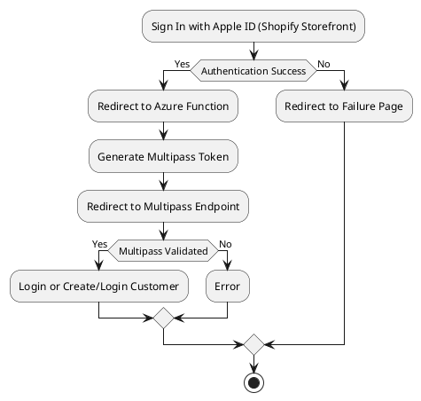

# 100 Days of Code: Day 1
In studying for my AZ-204, I needed to get moving on a project. This is a test that I've been delaying for about two years now, and it's time I get on it.

My first project is working on an Azure Function to generate tokens for Shopify's [Multipass](https://shopify.dev/api/multipass) feature. Multipass is a feature that allows you to generate a unique token that authenticates a new or existing customer account into a Shopify store.

Generating the token doesn't require anything special, except for a customer JSON object that will be used to create a customer with an account on the store. To use it properly however, it's best utilized with an external [IDP](https://en.wikipedia.org/wiki/Identity_provider), such as [Sign In with Apple](https://developer.apple.com/sign-in-with-apple/).

Here is a high level overview of how I imagine this will work - TBD.

Time to get started, will get some source code posted as soon as it's fit for testing.